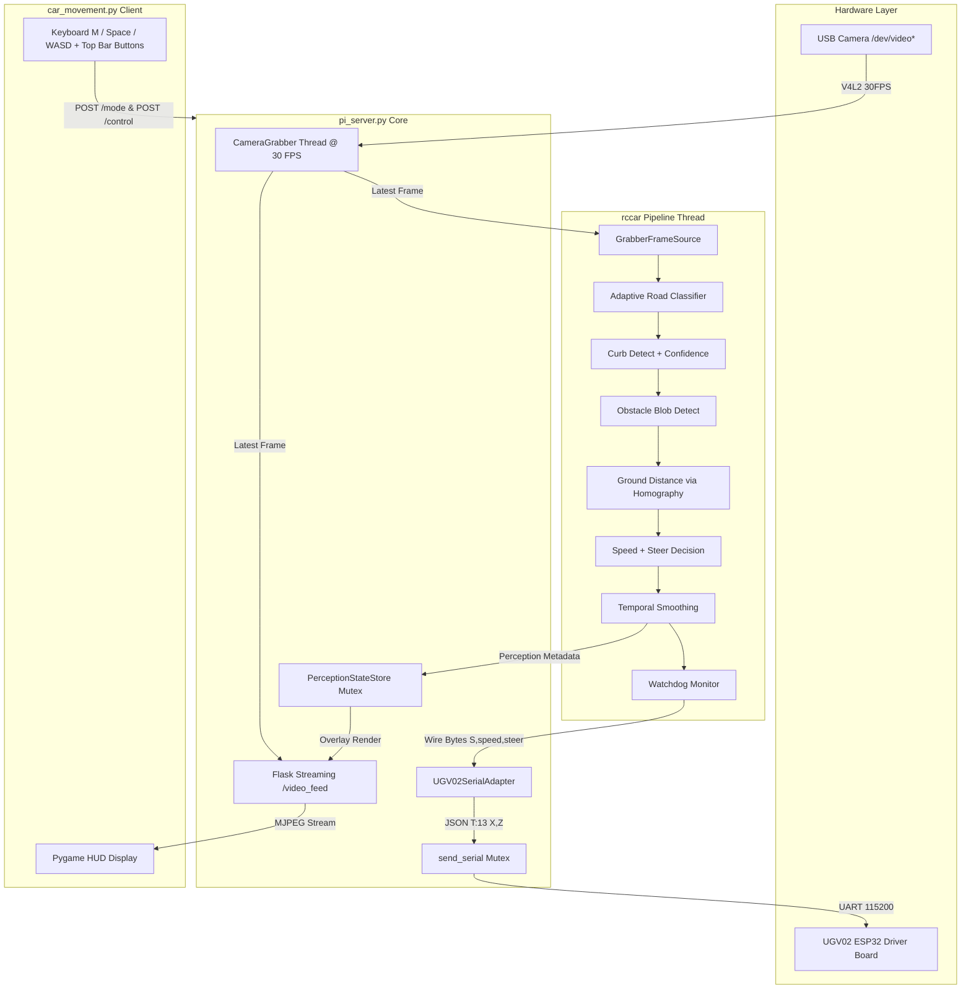

# RCCar Auto-Drive Integration Plan (UGV02 Autonomous Curb-Tracking & Obstacle Avoidance)

## Overview
Integrate `RCC_KrithikMohan` (`rccar`) perception and decision pipeline into `RC_Car_Movement` (`pi_server.py` and `car_movement.py`). Enable autonomous curb tracking, corridor maintenance, and roadside obstacle avoidance for UGV02 tracked/wheeled chassis. Provide seamless manual override, thread-safe dual-consumer camera capture, real-time perception overlay, and HUD client controls.

## Scope

### In-Scope
- Submodule / editable packaging linking `RCC_KrithikMohan` (`rccar`) to `RC_Car_Movement`.
- Complete `rccar` modules: curb line auto-detection, confidence tracker, corridor obstacle extraction, speed tier decision, steering offset, temporal smoothing, watchdog, and HUD overlay.
- `UGV02SerialAdapter` bridging `rccar` `S,<speed>,<steer>\n` protocol to UGV02 JSON velocity commands `{"T":13,"X":...,"Z":...}`.
- Speed tier translation: 0 -> 0.0 m/s (STOP), 1 -> -0.40 m/s (SLOW), 2 -> -0.70 m/s (FULL).
- Steer translation: [-100..100] -> Z angular velocity with sign inversion (negative steer left -> positive Z).
- Thread-safe `CameraGrabber` background thread eliminating Flask `/video_feed` and CV pipeline V4L2 lock contention.
- Real-time perception metadata overlay (curb line, corridor polygon, obstacle markers, distance) on `/video_feed` during auto mode.
- YAML configuration setup in `config/` (`homography.yaml`, `curb.yaml`, `steer.yaml`, `thresholds.yaml`, `watchdog.yaml`, `roi.yaml`).
- HUD client controls in `car_movement.py`: top bar `AUTO` toggle button, keyboard `M` toggle, `Space` e-stop, and instant override on `W/A/S/D`.
- Automated test suite (unit, integration, and mock hardware verification).

### Out-of-Scope
- Arduino / ESP32 firmware C++ modifications (protocol relies on existing UGV02 firmware `T:13`).
- Night-time / low-light IR camera perception (daylight CV only).
- Deep learning / neural network model training (classical OpenCV geometry only).

## Architecture & Data Flow

## Task List

### T0: Git Worktree Setup
- **Goal**: Create isolated git worktree for feature development.
- **Commands**:
  - `git worktree add ../worktree-rccar-autodrive -b feature/rccar-autodrive`
  - `cd ../worktree-rccar-autodrive`
- **Target File**: `../worktree-rccar-autodrive`
- **Depends on**: None
- **Test Cases**:
  - *Happy*: Worktree directory created, branch `feature/rccar-autodrive` checked out.
  - *Edge*: Worktree already exists -> Clean existing or reuse cleanly.
  - *Error*: Dirty working tree -> Stash or resolve before branching.
- **Acceptance Criteria**: `git branch --show-current` outputs `feature/rccar-autodrive`.

---

### T1: Package Scaffolding & Editable Submodule Link
- **Goal**: Link `RCC_KrithikMohan` as editable package and establish dependency manifest.
- **Changes**:
  - Create `requirements.txt` pinning `opencv-python`, `numpy`, `pyserial`, `pygame`, `requests`, `pyyaml`, `pytest`, and editable link `-e ../RCC_KrithikMohan`.
  - Install dependencies in virtual environment: `pip install -r requirements.txt`.
  - Verify package resolution with python import check.
- **Target Files**:
  - `requirements.txt`
  - `pyproject.toml`
- **Depends on**: T0
- **Test Cases**:
  - *Happy*: `python -c "import rccar; print(rccar.__file__)"` executes with exit code 0.
  - *Edge*: `RCC_KrithikMohan` missing -> Fallback instructions provided in error handler.
  - *Error*: Version conflict in numpy/opencv -> Explicit pins resolve cleanly.
- **Acceptance Criteria**: `pytest ../RCC_KrithikMohan/tests` passes.

---

### T2: Complete `rccar` Curb Perception & Confidence Modules
- **Goal**: Implement curb line detection, slope/side filtering, and multi-frame confidence tracking in `rccar`.
- **Changes**:
  - `src/rccar/curb/detect.py`: Filter Canny/Hough lines by slope threshold, segment road boundaries, auto-detect curb side (LEFT vs RIGHT vs NONE).
  - `src/rccar/curb/confidence.py`: Implement `CurbConfidenceTracker` with sliding window (N=5 frames). Track consecutive curb detections; trigger fallback state if curb lost > N frames.
- **Target Files**:
  - `../RCC_KrithikMohan/src/rccar/curb/detect.py`
  - `../RCC_KrithikMohan/src/rccar/curb/confidence.py`
  - `../RCC_KrithikMohan/tests/curb/test_detect.py`
- **Depends on**: T1
- **Test Cases**:
  - *Happy*: Feed synthetic image with clear right-side curb line -> Detects `side='right'` and correct line coordinates.
  - *Edge*: Curb missing for 6 frames -> `confidence_tracker.is_available()` returns `False`, enters `FALLBACK_CENTER`.
  - *Error*: Empty image array or all-black frame -> Returns `None` without exception.
- **Acceptance Criteria**: Unit tests in `test_detect.py` pass 100%.

---

### T3: Complete `rccar` Obstacle Detection & Distance Calculation
- **Goal**: Extract non-road obstacle blobs inside drivable corridor and compute ground-plane distance.
- **Changes**:
  - `src/rccar/obstacles/detect.py`: Combine road mask and curb corridor polygon. Find non-road contours within corridor, filter by minimum area threshold.
  - `src/rccar/obstacles/distance.py`: Project obstacle bottom-center coordinates through homography matrix (`image_point_to_ground`) to get ground distance in cm. Compute nearest obstacle Euclidean distance.
- **Target Files**:
  - `../RCC_KrithikMohan/src/rccar/obstacles/detect.py`
  - `../RCC_KrithikMohan/src/rccar/obstacles/distance.py`
  - `../RCC_KrithikMohan/tests/obstacles/test_detect.py`
- **Depends on**: T1, T2
- **Test Cases**:
  - *Happy*: Obstacle blob at 50cm forward distance -> Reports distance `50.0 +/- 3.0 cm`.
  - *Edge*: Blob outside drivable corridor (sidewalk/sky) -> Filtered out, nearest distance returns `inf` or `None`.
  - *Error*: Homography matrix with non-finite values -> Raises `ValueError` at initialization.
- **Acceptance Criteria**: Unit tests in `test_detect.py` pass with >95% obstacle recall on synthetic fixtures.

---

### T4: Complete `rccar` Decision & Smoothing Engine
- **Goal**: Implement 3-tier speed selection, curb lateral offset steering, and temporal jitter smoothing.
- **Changes**:
  - `src/rccar/decision/speed.py`: Map obstacle distance to `SpeedTier` (STOP < 30cm, SLOW < 100cm, FULL >= 100cm / clear).
  - `src/rccar/decision/steer.py`: Compute steering deflection [-100..100] using proportional offset from target curb distance (e.g. 40cm). If curb lost (fallback), set steer to 0 (center).
  - `src/rccar/decision/smoothing.py`: Ring buffer majority vote over last 3 frames for speed tier; moving average filter for steering deflection.
- **Target Files**:
  - `../RCC_KrithikMohan/src/rccar/decision/speed.py`
  - `../RCC_KrithikMohan/src/rccar/decision/steer.py`
  - `../RCC_KrithikMohan/src/rccar/decision/smoothing.py`
  - `../RCC_KrithikMohan/tests/decision/test_decision.py`
- **Depends on**: T3
- **Test Cases**:
  - *Happy*: Distance 25cm -> `SpeedTier.STOP` (0); Distance 60cm -> `SpeedTier.SLOW` (1); Distance 150cm -> `SpeedTier.FULL` (2).
  - *Edge*: Single-frame sensor glitch (STOP -> FULL -> STOP) -> Smoother preserves STOP via majority vote.
  - *Error*: Steer calculation receiving negative or NaN distance -> Gracefully clamps to neutral 0.
- **Acceptance Criteria**: `pytest ../RCC_KrithikMohan/tests/decision/test_decision.py` passes 100%.

---

### T5: Complete `rccar` Watchdog & HUD Overlay Renderer
- **Goal**: Implement system heartbeat watchdog and visual perception overlay renderer.
- **Changes**:
  - `src/rccar/watchdog/watchdog.py`: Monitor frame arrival interval (`frame_timeout_ms=500`), CV computation stalls, and serial write failures. Force emergency stop command if timeout exceeded.
  - `src/rccar/viz/overlay.py`: Draw semi-transparent drivable corridor polygon (cyan), detected curb line (green), obstacle bounding boxes & distances (red/yellow), and auto HUD status text on BGR frame.
- **Target Files**:
  - `../RCC_KrithikMohan/src/rccar/watchdog/watchdog.py`
  - `../RCC_KrithikMohan/src/rccar/viz/overlay.py`
  - `../RCC_KrithikMohan/tests/watchdog/test_watchdog.py`
- **Depends on**: T4
- **Test Cases**:
  - *Happy*: Pipeline normal -> Watchdog does not trip; overlay returns annotated frame.
  - *Edge*: Frame gap > 500ms -> Watchdog executes `serial_client.write(b"S,0,0\n")`.
  - *Error*: Overlay called with invalid/empty contour list -> Renders cleanly without crash.
- **Acceptance Criteria**: Watchdog unit tests pass with mocked timers.

---

### T6: Complete `rccar` Pipeline Runner & Execution Loop
- **Goal**: Build unified `run_pipeline()` entry point connecting capture, perception, decision, watchdog, and telemetry state callback.
- **Changes**:
  - `src/rccar/main.py`: Implement `run_pipeline(source, serial_client, homography, watchdog, state_callback=None, stop_event=None)`.
  - Export public API in `src/rccar/__init__.py`.
- **Target Files**:
  - `../RCC_KrithikMohan/src/rccar/main.py`
  - `../RCC_KrithikMohan/src/rccar/__init__.py`
  - `../RCC_KrithikMohan/tests/test_pipeline_smoke.py`
- **Depends on**: T5
- **Test Cases**:
  - *Happy*: Run pipeline on 30-frame synthetic clip -> Emits continuous sequence of valid `S,speed,steer` commands.
  - *Edge*: `stop_event.set()` called mid-run -> Pipeline exits cleanly within 100ms and sends stop command.
  - *Error*: Video source drops -> Watchdog triggers stop and pipeline exits gracefully.
- **Acceptance Criteria**: Integration smoke test passes end-to-end.

---

### T7: Configuration Setup in Workspace Root
- **Goal**: Create and validate all YAML config files in `RC_Car_Movement/config/`.
- **Changes**:
  - `config/homography.yaml`: 3x3 homography transform matrix for 320x240 image resolution to ground plane cm.
  - `config/curb.yaml`: Canny thresholds `[50, 150]`, Hough parameters, confidence window `5`, min confidence `0.6`.
  - `config/steer.yaml`: Target curb offset `40.0 cm`, P-gain `1.2`, max angular velocity Z `1.8 rad/s`.
  - `config/thresholds.yaml`: `stop_distance_cm: 30.0`, `slow_distance_cm: 100.0`.
  - `config/watchdog.yaml`: `frame_timeout_ms: 500`, `stall_timeout_ms: 500`.
  - `config/roi.yaml`: Road sampling trapezoid coordinates.
- **Target Files**:
  - `config/homography.yaml`
  - `config/curb.yaml`
  - `config/steer.yaml`
  - `config/thresholds.yaml`
  - `config/watchdog.yaml`
  - `config/roi.yaml`
- **Depends on**: T1
- **Test Cases**:
  - *Happy*: `yaml.safe_load()` loads all config files without syntax errors.
  - *Edge*: Missing key in config -> Validation script falls back to documented defaults.
  - *Error*: Malformed matrix dimensions in homography -> Validation script raises clear `ValueError`.
- **Acceptance Criteria**: All YAML files present and validated by config loader.

---

### T8: Implement Actuation Bridge (`UGV02SerialAdapter`) in `pi_server.py`
- **Goal**: Build serial adapter conforming to `rccar`'s `SerialClient` interface that translates wire protocol into UGV02 JSON velocity commands.
- **Changes**:
  - Implement `UGV02SerialAdapter` class in `pi_server.py`:
    - Method `write(data: bytes)`: Decodes `S,<speed>,<steer>\n` via `rccar.serial_client.protocol.decode_command`.
    - Speed mapping: `0` (STOP) -> `X = 0.0`, `1` (SLOW) -> `X = -0.40`, `2` (FULL) -> `X = -0.70`.
    - Steer mapping: `steer` in `[-100..100]` -> `Z = -(steer / 100.0) * MAX_STEER_Z` (left steer maps to positive Z).
    - Formats UGV02 JSON: `{"T":13,"X":<x>,"Z":<z>}`.
    - Transmits via thread-safe `send_serial()`.
    - Method `close()`: Sends stop velocity `{"T":13,"X":0.0,"Z":0.0}`.
- **Target Files**:
  - `pi_server.py`
  - `tests/test_serial_adapter.py`
- **Depends on**: T1, T7
- **Test Cases**:
  - *Happy*: `adapter.write(b"S,2,0\n")` sends `{"T":13,"X":-0.700,"Z":0.000}`.
  - *Happy*: `adapter.write(b"S,1,-50\n")` sends `{"T":13,"X":-0.400,"Z":0.900}` (left turn).
  - *Happy*: `adapter.write(b"S,0,0\n")` sends `{"T":13,"X":0.000,"Z":0.000}`.
  - *Edge*: Version string `b"V,1\n"` -> Ignored cleanly without error.
  - *Error*: Garbled bytes `b"INVALID\n"` -> Catches `ProtocolError`, logs warning, doesn't crash.
- **Acceptance Criteria**: `pytest tests/test_serial_adapter.py` passes 100%.

---

### T9: Dedicated Thread-Safe Camera Grabber & Perception Overlay in `pi_server.py`
- **Goal**: Eliminate V4L2 lock contention between Flask streaming and `rccar` pipeline while supporting real-time perception overlay.
- **Changes**:
  - Implement `CameraGrabber` class in `pi_server.py`:
    - Background capture thread continuously reads `cv2.VideoCapture` at 30 FPS into locked memory buffer.
    - Exposes thread-safe `read()` returning a fresh clone of latest frame.
    - Implements `GrabberFrameSource(FrameSource)` for `rccar` consumption.
  - Implement `PerceptionStateStore` in `pi_server.py`:
    - Stores latest curb coordinates, corridor polygon, obstacle list, speed tier, and steer.
    - Updated asynchronously by `rccar` pipeline callback.
  - Update Flask `/video_feed` (`gen_frames()`):
    - Reads frame from `CameraGrabber`.
    - If `drive_mode == 'auto'`, applies `rccar.viz.overlay.render_overlay()` onto frame before JPEG compression.
- **Target Files**:
  - `pi_server.py`
  - `tests/test_camera_grabber.py`
- **Depends on**: T6, T8
- **Test Cases**:
  - *Happy*: Concurrent reading from Flask stream and `rccar` pipeline maintains sustained ~30 FPS without frame dropping or V4L2 resource busy errors.
  - *Edge*: Camera disconnects -> Grabber returns cached test pattern or None without deadlock.
  - *Error*: Overlay renderer encounters corrupt perception metadata -> Falls back to raw frame.
- **Acceptance Criteria**: Unit test verifies simultaneous multi-threaded frame acquisition over 100 frames.

---

### T10: Pipeline Lifecycle & Auto Mode Endpoint Wiring in `pi_server.py`
- **Goal**: Wire up start/stop lifecycle for autonomous pipeline, manual override failsafes, and REST API endpoints.
- **Changes**:
  - Update `start_auto_pipeline()`:
    - Instantiates `GrabberFrameSource`, `UGV02SerialAdapter`, `Watchdog`, loads configs.
    - Spawns background worker thread running `run_pipeline()`.
    - Updates `drive_mode = 'auto'`.
  - Update `stop_auto_pipeline()`:
    - Sets stop event, disengages pipeline worker, reverts `drive_mode = 'manual'`.
    - Transmits stop command `{"T":13,"X":0.0,"Z":0.0}`.
  - Update endpoints:
    - `POST /mode`: Handles `{"mode": "auto"}` and `{"mode": "manual"}`.
    - `POST /control`: Any non-stop manual command (`'w'`, `'a'`, `'s'`, `'d'`, `'bl'`, etc.) instantly calls `stop_auto_pipeline()` and executes manual velocity targets.
    - `GET /telemetry`: Returns `drive_mode`, `rccar_available`, obstacle distance, and perception status.
- **Target Files**:
  - `pi_server.py`
  - `tests/test_api_endpoints.py`
- **Depends on**: T9
- **Test Cases**:
  - *Happy*: `POST /mode` with `{"mode": "auto"}` starts pipeline; `drive_mode` becomes `'auto'`.
  - *Happy*: During auto mode, receiving `POST /control` with `{"command": "w"}` instantly halts auto mode and switches to manual forward drive.
  - *Edge*: Requesting auto mode when `rccar` dependencies missing -> Returns HTTP 400 with descriptive JSON error.
  - *Error*: Pipeline thread crashes unexpectedly -> Watchdog catches error, safely restores manual mode and stops vehicle.
- **Acceptance Criteria**: `pytest tests/test_api_endpoints.py` passes 100%.

---

### T11: Client HUD Controls & UI Integration in `car_movement.py`
- **Goal**: Implement `AUTO` button, `M` keyboard toggle, `Space` e-stop, and instant override in Pygame HUD.
- **Changes**:
  - Add `RECT_AUTO` button on top navigation bar in `car_movement.py` (next to SPEED button).
  - Button state rendering:
    - GREEN `AUTO ON` when `telemetry['drive_mode'] == 'auto'`.
    - DARK `AUTO OFF` when in manual mode.
    - AMBER `AUTO ERR` if server rejects auto engagement.
  - Event Handling:
    - Click on `RECT_AUTO` sends `POST /mode` toggling between `'auto'` and `'manual'`.
    - Keypress `M` (pygame.K_m): Toggles auto mode.
    - Keypress `Space` (pygame.K_SPACE): Instant emergency stop (disengages auto and sends `'s'`).
    - Manual Drive Keys (`W`/`A`/`S`/`D`): When pressed during auto mode, immediately sends manual move command which triggers server-side auto disengagement.
  - Telemetry HUD Box:
    - Display `MODE: AUTO / MANUAL` with distinct color coding.
- **Target Files**:
  - `car_movement.py`
  - `tests/test_hud_logic.py`
- **Depends on**: T10
- **Test Cases**:
  - *Happy*: Pressing `M` sends `POST /mode {"mode": "auto"}`; HUD button updates to green `AUTO ON`.
  - *Happy*: Pressing `Space` while in auto mode sends stop command and disengages auto mode.
  - *Happy*: Pressing `W` while in auto mode immediately transmits manual `'b'` command.
  - *Edge*: Server offline -> Button click displays temporary red/amber connection error without crashing Pygame loop.
- **Acceptance Criteria**: Pygame event loop handles all shortcuts and overrides cleanly.

---

### T12: End-to-End System Integration & Simulation Tests
- **Goal**: Validate end-to-end pipeline with full integration test suite.
- **Changes**:
  - `tests/test_integration_autodrive.py`:
    - Test complete flow: Flask client -> Server -> `CameraGrabber` -> `rccar` perception -> `UGV02SerialAdapter` -> simulated serial output.
    - Test instant override latency (<50ms from manual keypress to auto disengagement).
    - Test watchdog stop trigger under simulated stalled video stream.
- **Target Files**:
  - `tests/test_integration_autodrive.py`
- **Depends on**: T10, T11
- **Test Cases**:
  - *Happy*: Synthetic test video with curb and obstacle causes simulated car to steer along curb and slow down/stop before obstacle.
  - *Happy*: Manual control injection halts autonomous loop within 1 frame tick.
  - *Edge*: High CPU load simulation -> Frame grabber drops stale frames gracefully, watchdog prevents command stagnation.
- **Acceptance Criteria**: Full test suite passes with `pytest tests/`.

---

### T13: Git Commit & Worktree Cleanup
- **Goal**: Stage, commit all verified changes on branch `feature/rccar-autodrive`, and cleanup worktree.
- **Commands**:
  - `git add .`
  - `git commit -m "feat(autodrive): integrate rccar autonomous driving pipeline with UGV02SerialAdapter and thread-safe CameraGrabber"`
  - `cd /home/bobjoe/PycharmProjects/RC_Car_Movement`
  - `git worktree remove ../worktree-rccar-autodrive`
- **Target Files**: Workspace repository
- **Depends on**: T12
- **Test Cases**:
  - *Happy*: `git worktree list` shows only main worktree; `git log` reflects feature commits on `feature/rccar-autodrive`.
- **Acceptance Criteria**: Working directory clean, feature branch ready for merge/PR.

## Test Strategy

1. **Unit Testing**:
   - `test_serial_adapter.py`: Validate exact JSON string construction and mathematical mapping across all speed tiers and steer angles [-100..100].
   - `test_camera_grabber.py`: Test thread safety, memory isolation, and frame cloning under multi-threaded concurrency.
   - `test_decision.py`: Table-driven tests validating threshold boundaries (29cm, 30cm, 99cm, 100cm).

2. **Hardware Parity / Mock Testing**:
   - Mock serial port using `serial.to_url('loop://')` or custom stream mock to verify bidirectional communication without physical hardware.
   - Synthetic frame generator with simulated curb edges and obstacle bounding boxes to verify perception and decision math.

3. **Failsafe & Latency Testing**:
   - Stalled grabber simulation to verify watchdog trips within 500ms and sends `X: 0.0, Z: 0.0`.
   - Manual override latency test ensuring manual WASD command halts auto worker in <50ms.

## Risk Analysis & Mitigations

| Risk | Severity | Mitigation |
| :--- | :--- | :--- |
| **V4L2 Device Lock Contention** | High | `CameraGrabber` background thread acts as the single owner of `cv2.VideoCapture`; all downstream consumers read thread-safe in-memory clones. |
| **Pi 3B/4B CPU Saturation** | High | Downsample CV perception pipeline to 320x240; reuse road histogram model over K=30 frames; optimize Hough line search to ROI. |
| **Inverted Steering Kinematics** | Medium | Strict unit testing on `UGV02SerialAdapter`: negative steer (left) strictly verified to map to positive Z angular velocity. |
| **Stale Motion Commands on Crash** | High | Watchdog timer in `rccar` + `pi_server` motion failsafe watchdog automatically zero velocities if no fresh commands arrive within 500ms. |
| **Video Stream Latency Spikes** | Medium | Perception overlay rendered directly onto frame clone before JPEG encoding; no secondary network round-trip for bounding boxes. |

## Open Questions & Coordination Points
- **Homography Ground Truth**: Real-world camera mount height and tilt angle need one-time validation using physical measurement marks (`scripts/calibrate_camera.py`).
- **UGV02 Wheel Slip**: Tracked vs wheeled skid-steer friction on smooth indoor floors vs asphalt may require tuning `MAX_STEER_Z` in `config/steer.yaml`.

## Post-Implementation Documentation Update
Update `README.md` in `RC_Car_Movement` to document:
1. Autonomous mode operation instructions (`AUTO` button / `M` key).
2. Configuration parameter reference in `config/*.yaml`.
3. Camera calibration procedure and setup steps for `rccar` pipeline.
